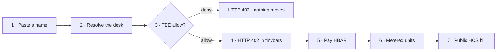
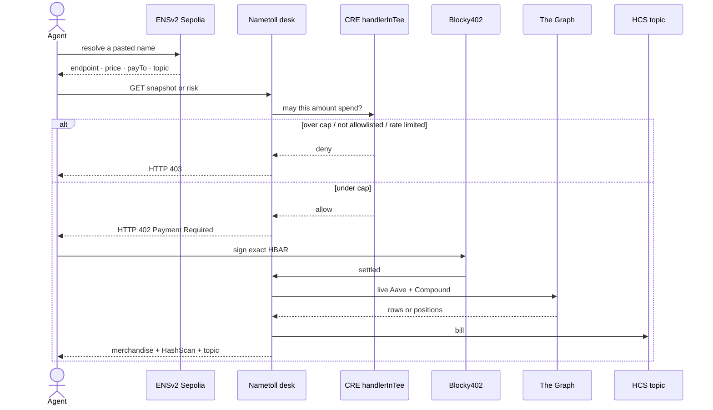
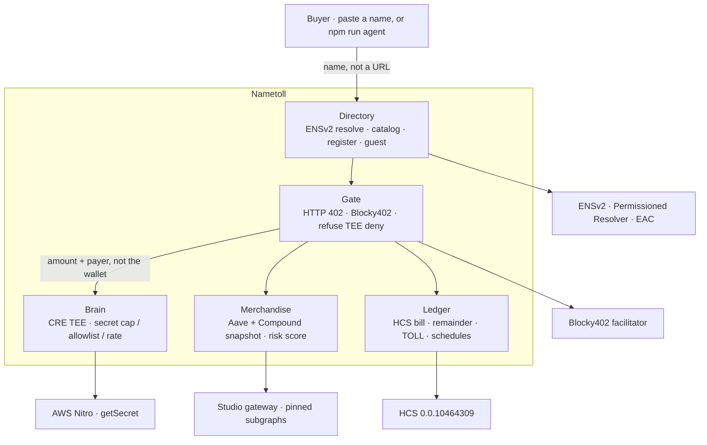

<p align="center">
  <a href="https://nametoll.run.place"></a>
  <a href="https://nametoll.run.place/app"></a>
  <a href="https://nametoll.run.place/desks"></a>
</p>

<h1 align="center">Nametoll</h1>

<p align="center"><b>A named pay desk for agents.</b><br />
Find a shop by an ENS name. A TEE the desk cannot read decides if you may spend.<br />
Pay in HBAR for what actually came back. The bill is public.</p>

<p align="center">
  <a href="https://nametoll.run.place"></a>
  <a href="#what-this-gives-each-ecosystem"></a>
  <a href="#what-this-gives-each-ecosystem"></a>
  <a href="#what-this-gives-each-ecosystem"></a>
  <a href="https://hashscan.io/testnet/topic/0.0.10464309"></a>
  <a href="https://hashscan.io/testnet/tx/0.0.7162784@1789111350.366520040"></a>
</p>

<p align="center">
  <a href="https://nametoll.run.place"><strong>Open the live desk →</strong></a>
  ·
  <a href="https://nametoll.run.place/desks">Browse <code>nametoll.eth</code></a>
  ·
  <a href="https://nametoll.run.place/app">Pay</a>
  ·
  <a href="https://nametoll.run.place/register">Register a child</a>
  ·
  <a href="https://nametoll.run.place/docs">Manual</a>
  ·
  <a href="https://github.com/shreyas-sovani/Nametoll">Repo</a>
</p>

**Form picks:** **Hedera** · **ENS** · **Chainlink**. Not on the form: World, The Graph.  
Filled partner checklists: [`docs/submission.md`](docs/submission.md) · Operator walkthrough: [`walkthrough.md`](walkthrough.md)

AI agents wrote code in this repo. A human directed the product and will narrate the video.

```text
name (ENSv2) → TEE allow (CRE) → pay (Blocky402) → metered units → HCS bill
```

---

## The problem

If an agent needs live lending data today, somebody hands it a URL, an API key, and a monthly invoice.

There is no name you can pass to another agent. The spend limit sits in a config the buyer can read. After the money moves, there is no receipt a stranger can check.

Hedera already has HTTP 402 on HBAR. What it does not have is a **service you can find and pay** — the official x402 PoC is still a flat-fee wrapper. ENS already has names. What it does not have on the happy path is a name that **is** the shop: endpoint, price, pay-to, and bill topic, with an operator who cannot walk away with the name. Chainlink already has a TEE. What they disqualify is a TEE that is not on the money path.

Nametoll is that missing shop.

---

## What we built

You paste a name. The name resolves to an HTTP origin, a Hedera account, a unit price, and an HCS topic. Before any HBAR moves, a Chainlink CRE workflow inside AWS Nitro loads a secret spend cap the desk process cannot see. Over cap is HTTP 403: no settle, no data, no bill. Under cap, unpaid traffic is still HTTP 402. After settle you get live Aave + Compound rows — or a one-unit health-factor score for a wallet you paste — and the same numbers appear on HashScan and on topic [`0.0.10464309`](https://hashscan.io/testnet/topic/0.0.10464309).

The happy path does not ship a name. You paste a name.

| You click | You get |
| --- | --- |
| [Live origin](https://nametoll.run.place) | Product, not localhost |
| [Browse desks](https://nametoll.run.place/desks) | Children of a pasted parent |
| [Pay console](https://nametoll.run.place/app) | Deny → allow → 402 → snapshot → bill |
| [Register](https://nametoll.run.place/register) | A constrained child under `nametoll.eth` |
| [Unpaid snapshot](https://nametoll.run.place/desk/snapshot) | HTTP 402, x402 v2, asset `0.0.0` |
| [Health](https://nametoll.run.place/health) | TEE source, merchandise live, faucet runway |

```bash
# Hit the live desk. Expect HTTP 402 — that is the product.
curl -sD - -H 'Accept: application/json' https://nametoll.run.place/desk/snapshot
```

---

## How it works



1. **Find.** Paste `nametoll.eth` on [`/desks`](https://nametoll.run.place/desks), or a child such as `desk.nametoll.eth` on [`/app`](https://nametoll.run.place/app). The name publishes the endpoint, pay-to `0.0.10463755`, `100000` tinybars per protocol, HCS `0.0.10464309`, asset `0.0.0`.
2. **Gate spend.** The desk asks the CRE TEE before Blocky402 settle. Cap is `150000` tinybars. Two protocols cost `200000` → deny. One protocol costs `100000` → allow. Allowlist and rate denials are separate public reasons.
3. **Pay.** Unpaid `GET /desk/snapshot` and `GET /desk/risk` are HTTP 402, x402 v2 `exact`, tinybars, fee-payer `0.0.7162784` from live Blocky402 `/supported`. The resource server does not hold a facilitator key.
4. **Meter.** Price scales with delivered protocols, not a flat fee. If an indexer is down we charge what arrived and refund unused prepaid HBAR.
5. **Bill.** Anyone GETs the Mirror Node, base64-decodes each message, and checks `units * priceTinybarsPerUnit = tinybars`.



---

## Architecture

One Express app. Six modules. Stable interfaces. No second product for a fourth partner.



| Module | Does | Does not |
| --- | --- | --- |
| **Directory** | Resolve a pasted name to a desk descriptor. `/desks` + `GET /desk/catalog` list children. `/register` issues a child (label, endpoint, optional expiry; price and pay-to stay this origin). Expired children resolve as unresolved. Guest session faucets 0.05 HBAR. | Store funds or secrets. Accept a judge-supplied price. Return a guest private key. |
| **Gate** | HTTP 402, Blocky402 verify/settle, refuse if the TEE denied. | Hold a facilitator key. |
| **Brain** | `handlerInTee`: secret cap + optional allowlist/rate → allow/deny. Verdicts are cached per amount + payer + hour-count (`VERDICT_TTL_MS`, default 60s). Keep-warm re-decides the pinned amounts every half TTL. One `cre workflow simulate` at a time; hung child killed at 60s. | `ConfidentialHTTPClient`. Leak secrets. Treat the risk wallet as a TEE input. |
| **Merchandise** | Live Aave v3 + Compound III snapshot. Units = delivered protocols. `GET /desk/risk?wallet=` is a 1-unit health factor. | Be a Graph prize SKILL. Claim privacy of public positions. |
| **Ledger** | HCS bill + recompute. Unused remainder refunded. Optional TOLL custom-fee token + `wait_for_expiry` subscribe/claim. | Move snapshot 402 off HBAR `0.0.0`. |
| **Buyer** | Resolve → TEE → 402 → sign → receipt. Operator key, guest session, or `npm run agent -- <parent>`. | Hardcode the name. |

---

## What this gives each ecosystem

Winners at ETHGlobal do not paste a partner logo on a landing page. They ship the thing that partner is missing.

### Hedera — a service you can actually pay

The 2026 AI track is explicit: x402 on Hedera is short of **services**, not another inference PoC. Nametoll is a live x402 v2 desk on testnet. Price scales with delivered units. Unused prepaid is refunded. Every bill is on HCS so a stranger can recompute it. The same desk also ships the extra rails Hedera asks for — a discovery directory an agent can walk, executed `wait_for_expiry` schedules, and TOLL (`0.0.10483302`) with a custom HBAR fee — without moving the 402 off asset `0.0.0`.

Guest faucet is 0.05 HBAR and closes with HTTP 503 if the seller is under 5 HBAR, so the demo cannot die by wallet drain. We also opened [hedera-dev/hedera-harness#59](https://github.com/hedera-dev/hedera-harness/pull/59) after in-place `init` adopt planted `yarn next:build` into this npm Express desk. Nametoll has no `.harness/` folder.

**Code:** [`src/modules/gate/index.ts`](src/modules/gate/index.ts) · [`src/modules/ledger/hcs.ts`](src/modules/ledger/hcs.ts)

### ENS — the name is the directory

`nametoll.eth` is an ENSv2 parent on Sepolia. Children carry their own Permissioned Resolver. EAC grants the operator `ROLE_SET_TEXT` on three documented keys (`url`, `agent-context`, `agent-endpoint[web]`) and no transfer role. `/register` issues a constrained, optionally expiring child. `gone.nametoll.eth` already expired on-chain and `/desks` marks it unresolved. No happy-path page ships a baked-in `.eth` name. `npm run agent -- nametoll.eth` discovers a live child and pays it.

**Code:** [`src/modules/directory/index.ts`](src/modules/directory/index.ts) · [`src/modules/directory/issue-subname.ts`](src/modules/directory/issue-subname.ts)

### Chainlink — the TEE sits on the money

`handlerInTee` loads `SPEND_CAP` (and optional `BUYER_ALLOWLIST` / `RATE_LIMIT`) inside AWS Nitro. A deny is HTTP 403 and Blocky402 never settles. Committed `cre workflow simulate` logs show the cap flip and the policy denials. The same HTTP handler emits unsigned `join()` to the live ChallengeLending contract. A later risk-score SKU reuses that gate without sending the wallet into the enclave — a new SKU does not mean a new simulate.

**Code:** [`cre/nametoll-brain/workflow.ts`](cre/nametoll-brain/workflow.ts) · Gate refuse: [`src/modules/gate/index.ts`](src/modules/gate/index.ts)

### The Graph — merchandise, not a prize

One Messari-shaped lending query across Aave v3 and Compound III, schemas fetched through Subgraph MCP, plus a desk-side health-factor SKU on the same pins. Live Studio gateway. Fail-soft if an indexer is down. This repo did not ship a Graph prize SKILL.

---

## Live evidence

Do not take this README on faith. Open the explorers.

| What | Where |
| --- | --- |
| TEE-gated settle (100000 tinybars, live Aave) | https://hashscan.io/testnet/tx/0.0.7162784@1789111350.366520040 |
| Unused-remainder refund | https://hashscan.io/testnet/tx/0.0.10463755@1789114039.622724528 |
| HCS topic `0.0.10464309` | https://hashscan.io/testnet/topic/0.0.10464309 |
| Mirror Node (recompute from here) | https://testnet.mirrornode.hedera.com/api/v1/topics/0.0.10464309/messages |
| TOLL custom-fee token | https://hashscan.io/testnet/token/0.0.10483302 |
| Executed schedule | https://hashscan.io/testnet/tx/0.0.10463842@1789156008.769559934 |
| Parent `nametoll.eth` | https://sepolia.etherscan.io/tx/0x28ab9c164cca6f967413f944a3ef1f81ca3ef86f7e1620fdc5b7a57d8d7a8a96 |
| Sibling `agent-02.nametoll.eth` | https://sepolia.etherscan.io/tx/0xd1f6f4faa9f11636fb64673ddfe6d458285e6cbf6ea79631c0d017c528c10454 |
| Expired `gone.nametoll.eth` | https://sepolia.etherscan.io/tx/0x44bbbd33adc88b3fb103eec45e2941ee4ad9eb14d8a0f446f738c7c2ac20d3ac |
| ChallengeLending `join()` | https://sepolia.etherscan.io/tx/0x980aaffe6d62561964a42675f7831adbca09cf442c7db0cede9255e2ed5e3086 |
| Cap allow / deny (Nitro `us-west-2`) | [`simulate-allow.log`](docs/partners/chainlink/simulate-allow.log) · [`simulate-deny.log`](docs/partners/chainlink/simulate-deny.log) |
| Allowlist / rate denials | [`simulate-allowlist-deny.log`](docs/partners/chainlink/simulate-allowlist-deny.log) · [`simulate-rate-deny.log`](docs/partners/chainlink/simulate-rate-deny.log) |

Recompute: `GET` the Mirror Node URL, base64-decode each `message`, then check `units * priceTinybarsPerUnit = tinybars`. If `prepaidTinybars` is present, `prepaidTinybars - tinybars = refundTinybars`. `PRICE_TINYBARS` is `100000` per delivered protocol.

---

## What the desk sells

Two SKUs, one meter, one TEE.

| SKU | Path | Units | What you paid for |
| --- | --- | --- | --- |
| Lending snapshot | `GET /desk/snapshot` | 1 per delivered protocol | Live Aave v3 + Compound III rows. Fail-soft if one indexer is down. |
| Risk score | `GET /desk/risk?wallet=` | 1 | Health factor, distance to liquidation, worst market. Wallet picks the book. It is not a TEE input. Public positions are not sold as private. |

TEE verdicts are **cached per amount** + payer + hour-count so a cold click does not sit for nine seconds. Default TTL is 60s (`VERDICT_TTL_MS`; set `1800000` on judging day). Unavailable / simulate failures are not cached. Missing TEE fails closed.

---

## Demo (2–4 min, ≥720p, human voice)

Record the live desk at https://nametoll.run.place. Paste a name. Do not bake one into the take. Full spoken script: [`docs/submission.md`](docs/submission.md).

| Clock | On camera | Why it qualifies |
| --- | --- | --- |
| 0:00 | Landing `/` — name → TEE → 402 → meter → HCS | Product, not a slide |
| 0:45 | Paste `nametoll.eth` on `/desks`. Open a live child | ENS live resolve + Hedera directory |
| 1:20 | Meter = 2. Open desk. Pay locked | Chainlink deny changes the path |
| 2:05 | Meter = 1. Open desk. Unpaid GET is HTTP 402 | Hedera x402 v2 + Chainlink allow |
| 2:25 | Pay. Live Aave. HashScan settle | Hedera paid request, TEE on the path |
| 2:55 | HCS topic `0.0.10464309`. Recompute matches | Hedera HCS |
| 3:25 | Score wallet (if clock remains) | Same 402, wallet is not a TEE input |
| 3:50 | Hold `/app`. Stop before 4:00 | — |

---

## Quickstart

```bash
npm install
cp .env.example .env
npm test
npm start
```

```bash
curl -s http://127.0.0.1:8787/health
curl -sD - -H 'Accept: application/json' http://127.0.0.1:8787/desk/snapshot

# Discover then pay (parent only — no hardcoded child)
npm run agent -- nametoll.eth

# Guest payer (cookie; JSON never includes the key)
curl -sS -X POST http://127.0.0.1:8787/desk/session
curl -sS -X POST http://127.0.0.1:8787/desk/pay \
  -H 'content-type: application/json' \
  -d '{"name":"desk.nametoll.eth","protocols":["aave-v3-ethereum"],"payer":"guest"}'
```

Pages: `/` landing · `/desks` registry · `/register` claim a child · `/app` pay console · `/docs` manual.

Localhost is not the demo target. **Public origin:** https://nametoll.run.place

<details>
<summary>More CLI, HTTP, and operator notes</summary>

```bash
npm run buyer -- <paste-a-name>
npm run directory -- <paste-a-name>
npm run subscribe -- --plan --slots 2 --interval-sec 120
npm run hts -- probe
npm run join -- --check
npm run graph:probe
npm run topic:create
npm run brain -- 100000
npm run cre:simulate
```

```bash
curl -sS "http://127.0.0.1:8787/desk/resolve?name=<paste-a-name>"
curl -sS "http://127.0.0.1:8787/desk/inspect?name=<paste-a-name>&protocols=aave-v3-ethereum"
curl -sS -X POST http://127.0.0.1:8787/desk/pay \
  -H 'content-type: application/json' \
  -H "x-desk-pay-secret: ${DESK_PAY_SECRET:-}" \
  -d '{"name":"<paste-a-name>","protocols":["aave-v3-ethereum"]}'
curl -sS -X POST http://127.0.0.1:8787/desk/register \
  -H 'content-type: application/json' \
  -d '{"label":"<paste-a-label>","expiresIn":90}'
curl -sS "http://127.0.0.1:8787/desk/catalog?parent=nametoll.eth"
curl -sS http://127.0.0.1:8787/desk/ledger
```

`GET /desk/inspect` stays open. `POST /desk/pay` spends the operator buyer key or a guest session (`{ "payer": "guest" }` after `POST /desk/session`). Both are rate-limited, optionally gated by `DESK_PAY_SECRET`, and pinned to `PUBLIC_DESK_URL` when that is set. Guest keys stay in memory.

A successful settle prints a HashScan URL. Live testnet settles and HCS bills are in `docs/working-notes.md`.

</details>

---

## Do not commit secrets

Copy `.env.example` to `.env` and fill names locally. Never commit `.env`, private keys, facilitator keys, CRE secrets, or Graph/World tokens. The resource server must **not** hold a Blocky402 facilitator private key.

<details>
<summary>Config the desk actually reads</summary>

| Name | Role |
| --- | --- |
| `PUBLIC_DESK_URL` | Live origin `https://nametoll.run.place`. Pins pay to this host when set. |
| `X402_NETWORK` | CAIP-2 network, typically `hedera:testnet` |
| `FACILITATOR_URL` | Blocky402 testnet: `https://api.testnet.blocky402.com` |
| `HEDERA_SELLER_ACCOUNT_ID` | Desk `payTo` (Hedera account id, not an EVM address) |
| `HEDERA_SELLER_PRIVATE_KEY` | Seller signer for HCS submit only — never a facilitator key |
| `HCS_TOPIC_ID` | Ledger topic (`0.0.10464309` on testnet) |
| `MIRROR_NODE_URL` | Default `https://testnet.mirrornode.hedera.com` |
| `GRAPH_GATEWAY_KEY` | Subgraph Studio **query** API key. Deploy keys and Token API keys are rejected. |
| `HEDERA_BUYER_*` | Buyer signer only — never the seller key |
| `ENSNODE_URL` | ENSv2 Omnigraph, default `https://api.v2-sepolia.ensnode.io` |
| `ENS_OWNER_ADDRESS` / `ENS_OPERATOR_ADDRESS` | Public Sepolia addresses. Not keys. Not a name. |
| `CRE_PROJECT_DIR` / `CRE_WORKFLOW_NAME` / `CRE_TARGET` | Simulate backend. Defaults to `./cre` + `nametoll-brain` + `staging-settings`. |
| `VERDICT_TTL_MS` | TEE cache TTL. Default `60000`. Use `1800000` on judging day. |
| `GUEST_FAUCET_TINYBARS` / `GUEST_FAUCET_FLOOR_TINYBARS` / `GUEST_MAX_ACTIVE` | Guest faucet size, seller floor, concurrent guests. |
| `HTS_TOKEN_ID` | Optional TOLL desk-credit token. Does not change snapshot 402 asset `0.0.0`. |

Fee-payer is **not** configured here. The Gate reads it from live `GET /supported`.

</details>

---

## Live ENSv2 directory

| | |
| --- | --- |
| Parent | `nametoll.eth` |
| Child | `desk.nametoll.eth` |
| Second desk | `agent-02.nametoll.eth` — own Permissioned Resolver `0xe41Fab44355C6169af965C7994743625198561Da` |
| Expired child | `gone.nametoll.eth` — 90s expiry, now `AVAILABLE` / unresolved on `/desks` |
| Owner | `0xD2aA21AF4faa840Dea890DB2C6649AACF2C80Ff3` |
| Operator (text keys only) | `0xFeAf5C921996FC53f4DEf35e181E766e6D74690A` |
| Permissioned Resolver | `0x558283D5F8E36316B60be7e24F4e58C7133752D2` |
| Parent UserRegistry | `0x0531cdfAa619d1Ce33B37e87AAcD685bEcd976B9` |

Buyer and homepage still take a pasted name. They do not default to `nametoll.eth`.

---

## Sunday form swap (B16)

This paragraph is the swap record. It was written while the form line above still named Hedera · ENS · Chainlink.

**Decision: no swap.** Third slot stays Chainlink.

| Candidate | Evidence | Form? |
| --- | --- | --- |
| **Chainlink** | `handlerInTee` simulate logs exist: `docs/partners/chainlink/simulate-allow.log`, `simulate-deny.log`, `simulate-join.log`, `simulate-allowlist-deny.log`, `simulate-rate-deny.log`. TEE gates Blocky402 settle. | **Yes** (third slot) |
| **The Graph** | Live Messari composition across Aave v3 + Compound III, pinned Studio ids, MCP schemas, fail-soft. That is merchandise. This repo did not ship a Graph prize SKILL. | No |
| **World** | Selfie Check flag was not on. No `@worldcoin/idkit`, no `selfieCheckLegacy`. Not a form pick. | No |

ETHOnline still allows only three partner prizes. Hedera (pay + HCS) and ENS (the name) stay. Graph stays off the form as live data the desk sells. World stays off the form.

---

See [`docs/PRD.md`](docs/PRD.md), [`docs/BACKLOG.md`](docs/BACKLOG.md), and [`docs/submission.md`](docs/submission.md).
