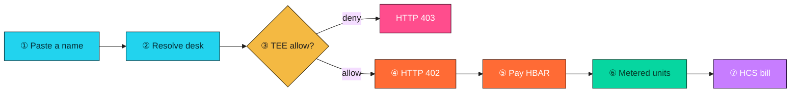
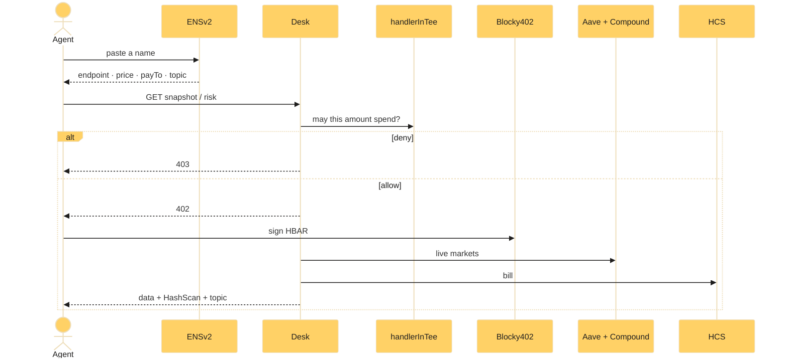
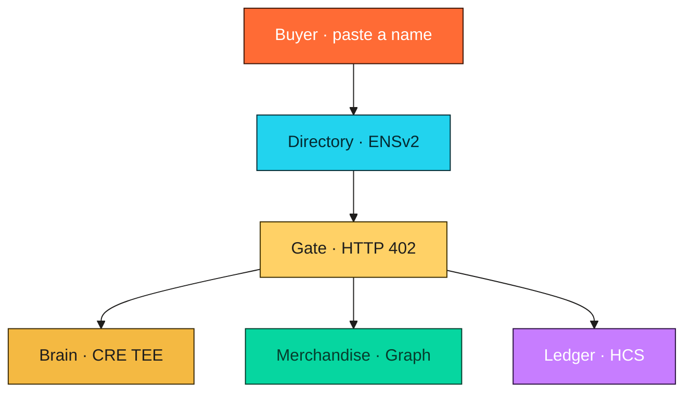

<p align="center">
  
</p>

<h1 align="center">Nametoll</h1>

<p align="center"><b>Find a shop by name. A TEE decides if you may spend.<br />Pay in HBAR for what came back. The bill is public.</b></p>

<p align="center">
  <a href="https://nametoll.run.place"></a>
  <a href="https://nametoll.run.place/app"></a>
  <a href="https://nametoll.run.place/desks"></a>
  <a href="https://nametoll.run.place/register"></a>
</p>

<p align="center">
  
  
  
  
  
  
  
</p>

**Form picks:** **Hedera** · **ENS** · **Chainlink**. Not on the form: World, The Graph.

AI agents wrote code in this repo. A human directed the product and will narrate the video.

```text
name → TEE allow → pay → metered units → HCS bill
```

---

## The problem

- Agents get a URL, an API key, and a monthly invoice.
- There is no name you can hand to another agent.
- The spend cap sits in a config the buyer can read.
- After HBAR moves, nobody else can check the bill.

## What we ship

- Paste a name. It resolves to origin, price, pay-to, and HCS topic `0.0.10464309`.
- A CRE `handlerInTee` loads a secret cap the desk cannot see.
- Over cap → HTTP 403. Nothing settles.
- Under cap → HTTP 402 in tinybars. Pay only for delivered units.
- Snapshot = live Aave + Compound. Risk = one-unit health factor.
- Anyone recomputes `units * priceTinybarsPerUnit = tinybars` from Mirror Node.

The happy path does not ship a name. You **paste a name**.

---

## How it works



- **Find** — paste `nametoll.eth` on [`/desks`](https://nametoll.run.place/desks) or a child on [`/app`](https://nametoll.run.place/app).
- **Cap** — `150000` tinybars in Nitro. 2 protocols = `200000` → deny. 1 protocol = `100000` → allow.
- **Pay** — unpaid `GET /desk/snapshot` and `GET /desk/risk` are HTTP 402, x402 v2 `exact`, asset `0.0.0`.
- **Meter** — price scales with delivered protocols. Unused prepaid is refunded.
- **Bill** — HCS `0.0.10464309`. Recompute from https://testnet.mirrornode.hedera.com/api/v1/topics/0.0.10464309/messages



---

## Architecture

One app. Six modules.



- **Directory** — resolve, list children, register a child, guest faucet 0.05 HBAR.
- **Gate** — 402 + Blocky402. No facilitator key.
- **Brain** — `handlerInTee` cap / allowlist / rate. Verdicts **cached per amount**. TTL default 60s.
- **Merchandise** — Messari-shaped Aave + Compound snapshot. 1-unit risk score.
- **Ledger** — HCS bill, remainder refund, optional TOLL + schedules.
- **Buyer** — resolve → TEE → 402 → receipt. Or `npm run agent -- <parent>`.

---

## What their ecosystems did not have

### Hedera
- A **service** you can find and pay — not another flat-fee PoC.
- Metered units + unused remainder + a public HCS bill.
- Directory, executed schedules, TOLL custom fee. Snapshot 402 stays HBAR `0.0.0`.

### ENS
- A name that **is** the shop: endpoint, price, pay-to, topic.
- ENSv2 parent `nametoll.eth`. Permissioned Resolver. Operator can edit three text keys, cannot transfer.
- Expiring children. `gone.nametoll.eth` already expired.

### Chainlink
- A TEE **on the money path**. Deny = no settle.
- Same `handlerInTee` emits unsigned ChallengeLending `join()`.
- Risk SKU reuses the gate. Wallet is not a TEE input.

### The Graph — used, not a prize
- Live Aave v3 + Compound III. Fail-soft if an indexer is down.
- This repo did not ship a Graph prize SKILL.

---

## Try it

```bash
curl -sD - -H 'Accept: application/json' https://nametoll.run.place/desk/snapshot
```

- [Open the desk](https://nametoll.run.place)
- [Browse `nametoll.eth`](https://nametoll.run.place/desks)
- [Pay](https://nametoll.run.place/app)
- [Register a child](https://nametoll.run.place/register)

---

## Quickstart

```bash
npm install
cp .env.example .env
npm test
npm start
```

```bash
curl -s http://127.0.0.1:8787/health
npm run agent -- nametoll.eth
```

- Pages: `/` · `/desks` · `/register` · `/app` · `/docs`
- Demo target is https://nametoll.run.place — not localhost.

---

## Demo · 2–4 min

Record the live site. Paste a name. Human voice.

| Clock | On camera |
| --- | --- |
| 0:00 | Landing — name → TEE → 402 → meter → HCS |
| 0:45 | `/desks` · paste `nametoll.eth` |
| 1:20 | 2 protocols · Pay locked · Chainlink deny |
| 2:05 | 1 protocol · HTTP 402 · Hedera + allow |
| 2:25 | Pay · live Aave · HashScan settle |
| 2:55 | HCS `0.0.10464309` · recompute |
| 3:25 | Score wallet if clock remains |
| 3:50 | Hold. Stop before 4:00 |

---

## Do not commit secrets

Copy `.env.example` to `.env`. Never commit keys, facilitator secrets, CRE secrets, or Graph tokens.

---

## Sunday form swap (B16)

This paragraph is the swap record. It was written while the form line above still named Hedera · ENS · Chainlink.

**Decision: no swap.** Third slot stays Chainlink.

- **Chainlink** — `handlerInTee` simulate logs exist. Form yes.
- **The Graph** — merchandise only. Off the form.
- **World** — Selfie Check flag was not on. Not a form pick.
