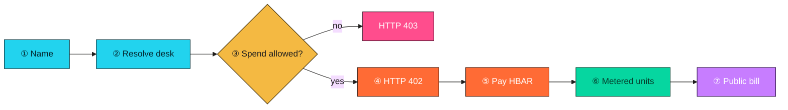
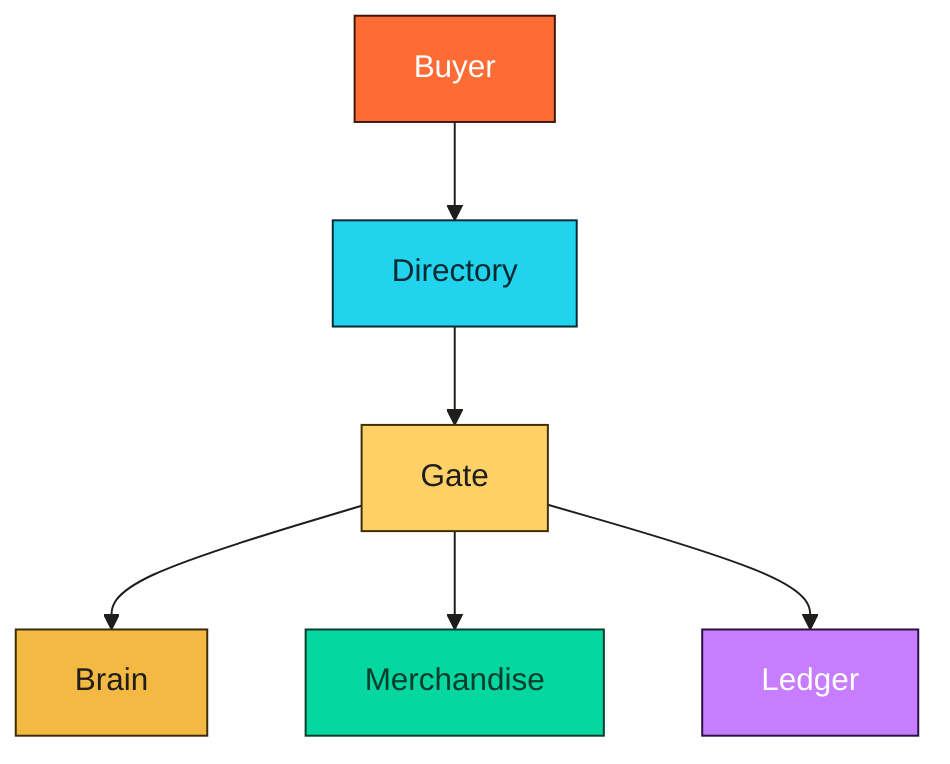

<p align="center">
  
</p>

<h1 align="center">Nametoll</h1>

<p align="center"><b>A named pay desk.</b><br />
Look up a shop by name. A spend rule the desk cannot read decides if you may pay.<br />
You pay in HBAR for what came back. Anyone can recompute the bill.</p>

<p align="center">
  <a href="https://nametoll.run.place"></a>
  <a href="https://nametoll.run.place/desks"></a>
  <a href="https://nametoll.run.place/app"></a>
  <a href="https://nametoll.run.place/register"></a>
</p>

<p align="center">
  
  
  
  
  
  
</p>

```text
name → spend check → HTTP 402 → metered units → public bill
```

---

## Why it exists

- Buying live market data still means a URL, an API key, and a monthly invoice.
- That handle is not portable. You cannot hand a shop to another agent.
- The spend limit lives in a config the buyer can read.
- After payment, there is no receipt a stranger can check.

Nametoll is the shop for that job.

---

## What you get

- A desk you find by **name**, not by a hardcoded host.
- A spend cap sealed in a TEE. Over cap is HTTP 403. Nothing settles.
- Unpaid traffic is HTTP **402**. Price is tinybars per delivered unit.
- Two products on the same meter:
  - **Snapshot** — live Aave + Compound lending rows
  - **Risk score** — health factor, distance to liquidation, worst market
- A public HCS bill. Recompute: `units * priceTinybarsPerUnit = tinybars`

---

## How a request works



- Resolve the name → origin, price, pay-to, bill topic.
- Ask the TEE if this amount may spend.
- Pay the 402 in HBAR. Unused prepaid is refunded.
- Read the rows. Check the bill on topic `0.0.10464309`.

```bash
curl -sD - -H 'Accept: application/json' https://nametoll.run.place/desk/snapshot
```

---

## Architecture

One service. Six modules.



- **Directory** — resolve a name, list children, publish a child, open a guest buyer.
- **Gate** — HTTP 402, verify, settle. Does not hold the facilitator key.
- **Brain** — sealed spend cap, optional allowlist and rate. Cached per amount.
- **Merchandise** — live Aave + Compound. Risk score is one unit.
- **Ledger** — append the bill. Refund unused prepaid.
- **Buyer** — resolve, ask the gate, pay, print the receipt.

---

## API

| Call | What happens |
| --- | --- |
| `GET /desk/resolve?name=` | Descriptor: origin, price, pay-to, topic |
| `GET /desk/catalog?parent=` | Children under a parent name |
| `GET /desk/snapshot` | 402, then live lending rows |
| `GET /desk/risk?wallet=` | 402, then a health-factor score |
| `GET /desk/ledger` | Recent bills |
| `POST /desk/session` | Guest buyer (key stays on the server) |
| `POST /desk/pay` | Resolve → spend check → settle |
| `POST /desk/register` | Publish a child name for this desk |

Pages: [`/`](https://nametoll.run.place) · [`/desks`](https://nametoll.run.place/desks) · [`/app`](https://nametoll.run.place/app) · [`/register`](https://nametoll.run.place/register) · [`/docs`](https://nametoll.run.place/docs)

---

## Run it

```bash
npm install
cp .env.example .env
npm start
```

```bash
curl -s http://127.0.0.1:8787/health
npm run agent -- nametoll.eth
```

Live origin: https://nametoll.run.place

Bills: https://testnet.mirrornode.hedera.com/api/v1/topics/0.0.10464309/messages

---

## Stack

- **Name** — ENS. The name is the directory.
- **Pay** — HBAR over HTTP 402 (x402 v2, exact, tinybars).
- **Spend rule** — confidential TEE. Deny means no settle.
- **Data** — The Graph. Aave v3 + Compound III. Fail-soft if an indexer is down.
- **Bill** — Hedera Consensus Service. Public, recomputable.
